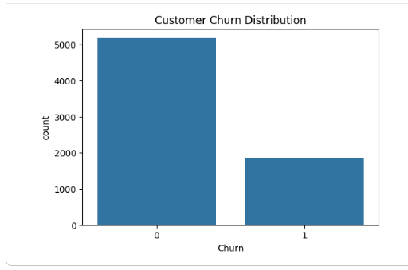
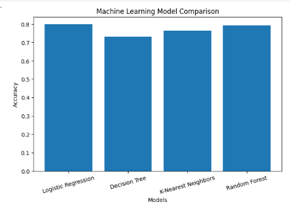
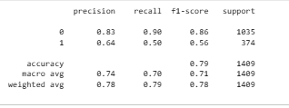
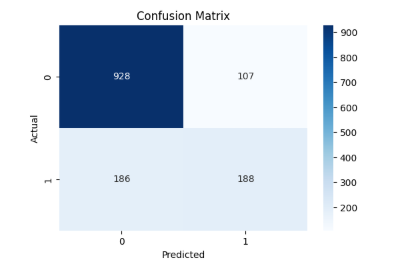
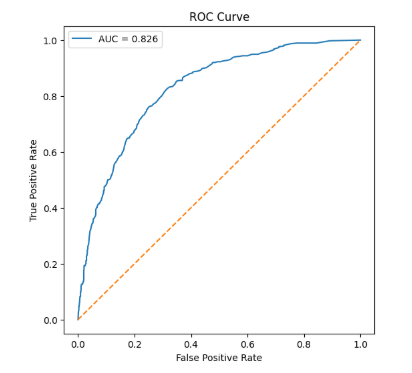
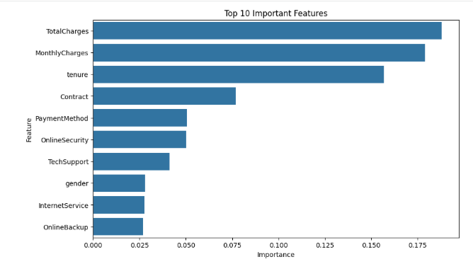
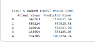

# Customer Churn Prediction using Machine Learning

## Project Overview

This project predicts whether a telecom customer is likely to churn (leave the service) using Machine Learning. The dataset is cleaned, preprocessed, analyzed, and used to train multiple classification models. The performance of each model is compared to identify the best-performing algorithm.

---

## Problem Statement

Customer churn is one of the biggest challenges faced by telecom companies. Predicting which customers are likely to leave helps businesses take proactive measures to improve customer retention and reduce revenue loss.

---

## Dataset

- **Dataset:** Telco Customer Churn Dataset
- **Target Variable:** Churn
- **Type:** Binary Classification

The dataset contains customer information such as:

- Customer demographics
- Internet services
- Contract type
- Monthly charges
- Total charges
- Payment method
- Senior citizen status
- Tenure

---

## Technologies Used

- Python
- Pandas
- NumPy
- Matplotlib
- Seaborn
- Scikit-learn
- Joblib
- Google Colab
- GitHub

---

## Machine Learning Models

The following models were trained and compared:

- Logistic Regression
- Decision Tree Classifier
- K-Nearest Neighbors (KNN)
- Random Forest Classifier

---

## Project Workflow

1. Import Libraries
2. Load Dataset
3. Data Cleaning
4. Exploratory Data Analysis (EDA)
5. Feature Engineering
6. Train-Test Split
7. Train Multiple ML Models
8. Compare Model Performance
9. Evaluate Best Model
10. Save Trained Model

---

## Model Evaluation

The models were evaluated using:

- Accuracy
- Precision
- Recall
- F1 Score
- Confusion Matrix
- ROC Curve
- AUC Score

---

## Repository Structure

```text
Customer-Churn-Prediction/
│
├── Customer_Churn_Prediction.ipynb
├── WA_Fn-UseC_-Telco-Customer-Churn.csv
├── README.md
├── requirements.txt
├── .gitignore
└── images/
```

---

## Future Improvements

- Perform Hyperparameter Tuning
- Handle Class Imbalance using SMOTE
- Deploy the model using Streamlit
- Create a prediction web application
- Improve model performance with advanced algorithms

---

## Project Screenshots

### Churn Distribution


### Correlation Heatmap


### Model Comparison


### Accuracy Comparison


### Confusion Matrix


### ROC Curve


### Feature Importance


### Sample Prediction

## Author

**Bushra Naseem**

Aspiring Data Scientist | Machine Learning Enthusiast

---

## If you found this project useful

⭐ Star this repository if you found it helpful.
